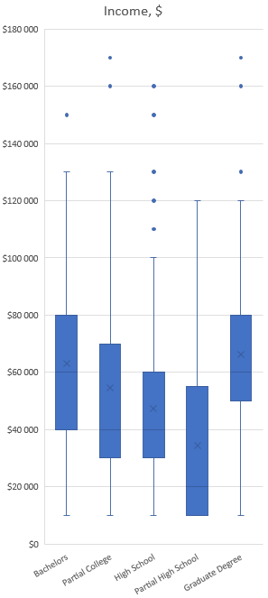
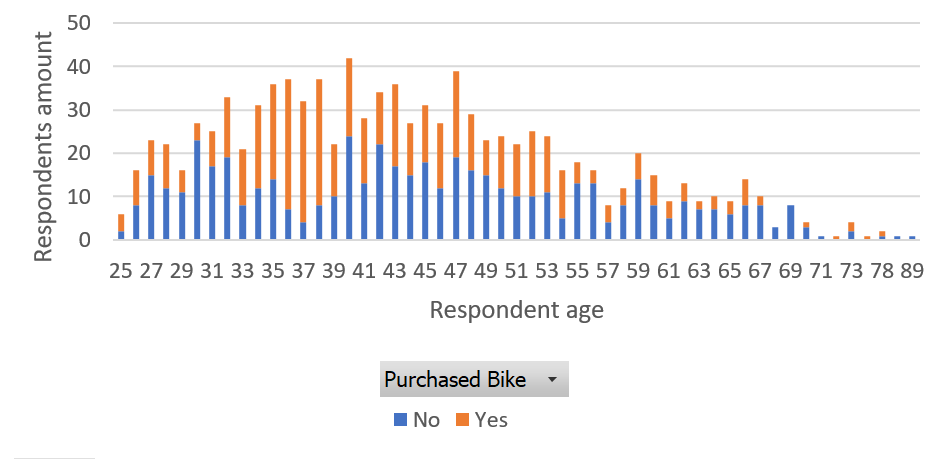
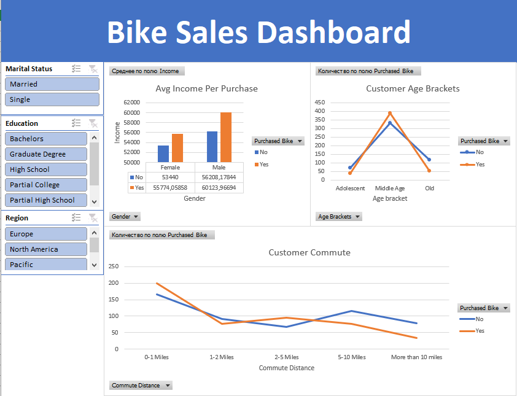

# Bike buyers research
Raw data on bike buyers provided. Clean up data, research on buyers income and age distribution. Make dashboard for thurther research.

## Clean and improve data
* Remove duplicates,
* Replace single letter parameters with full words like M -> Male or Married.

## Analysis
* Add age brackets column to simplify research,
* Build descriptive statistics table on buyers income:

| Income                   |              |
|--------------------------|--------------:|
|                          |              |
| Mean                     | 56360,00     |
| Standard error           | 983,01       |
| Median                   | 60000,00     |
| Mode                     | 60000,00     |
| Standard deviation       | 31085,64     |
| Sample variance          | 966316716,72 |
| Excess                   | 0,50         |
| Asymmetry                | 0,75         |
| Interval                 | 160000,00    |
| Minimum                  | 10000,00     |
| Maximum                  | 170000,00    |
| Sum                      | 56360000,00  |
| Count                    | 1000,00      |
| Greatest (1)              | 170000,00    |
| Least (1)                 | 10000,00     |
| Reliability level (95,0%) | 1929,01      |

* Box and wiskers plot with income to education dependency shows highest values for buyers with Bachelor or Graduate degree,

* Stacked histogram shows most customers who buy of age 31 to 53.

For thurther research one may use dashboard with filters by marital status, education and region.

